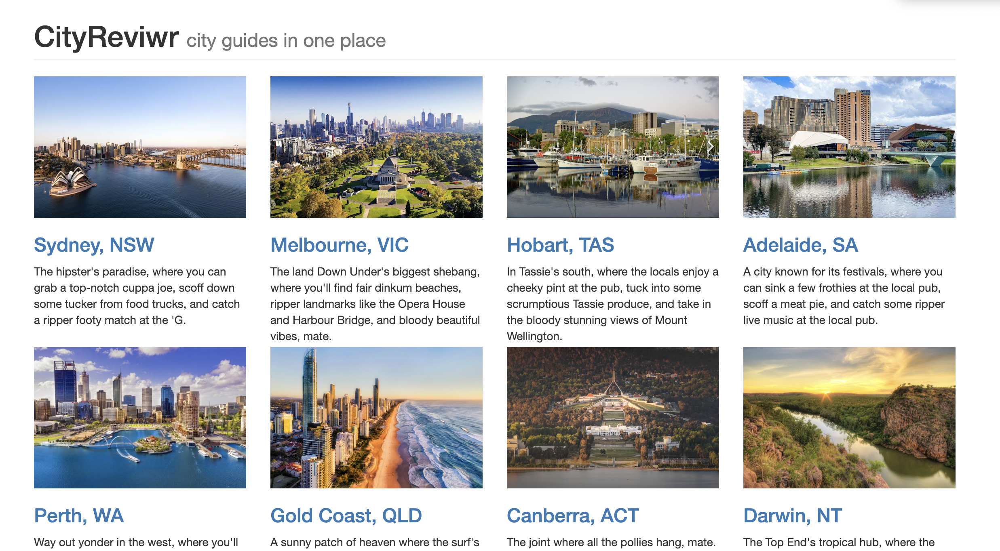
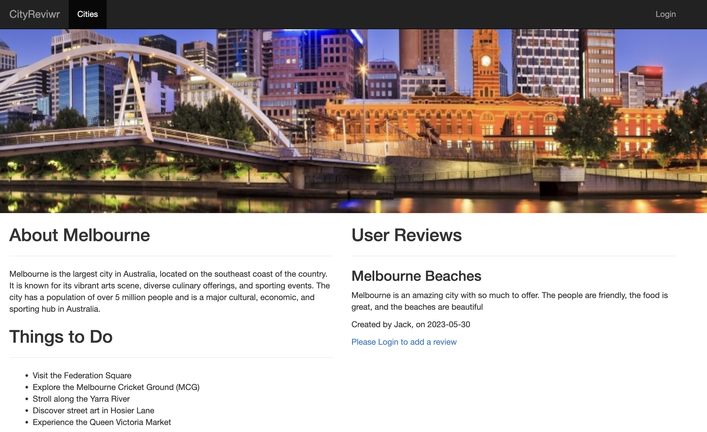
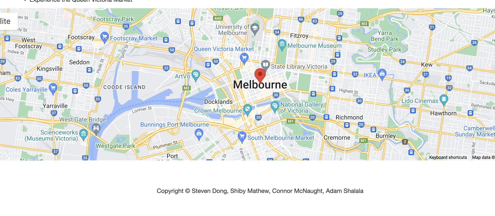
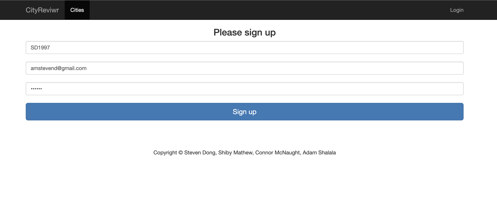
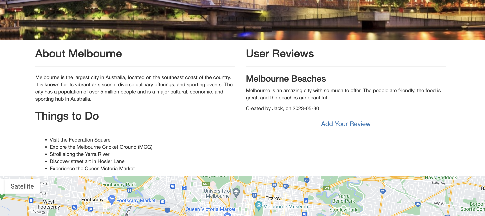
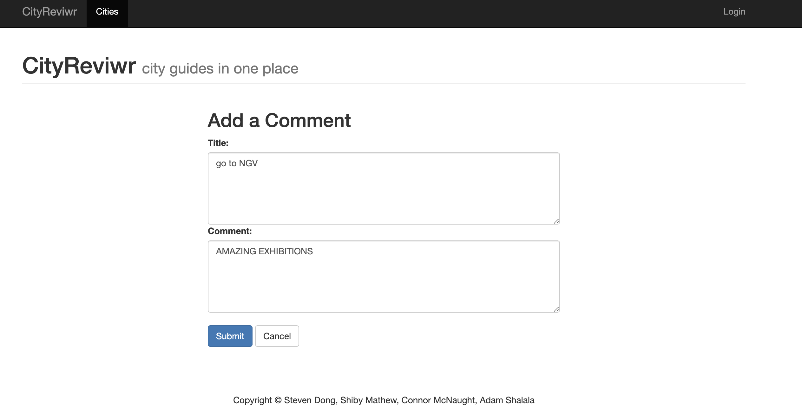
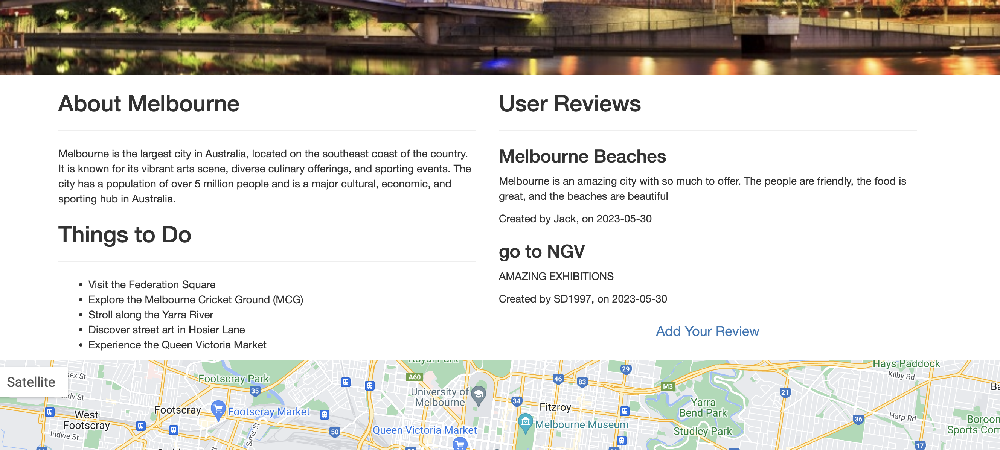

# Overview of the Cityreviewr

"Introducing CityReviewr, the ultimate platform for city explorers! Whether you're a traveller seeking authentic experiences or a local wanting to share your insights, CityReviewr is your go-to web app. Easily register, log in, and leave honest reviews about cities you've visited, helping fellow adventurers make informed decisions. From hidden gems to popular attractions, CityReviewr empowers you to share your unique perspective and discover new destinations. Join the CityReviewr community today and unlock a world of shared experiences!"

## Authors
- [@StevenDong] (https://github.com/StevenDong2512)
- [@ShibyMathew] (https://github.com/Shiby-Mathew)
- [@ConnorMcNaught] (https://github.com/con118)
- [@AdamShalala] (https://github.com/supershalala)

## Features of The Web App
-Accessing 8 of Australian biggest citys.
-Visualising a google map of the city on landing page.
-User has the ability to login and logout.
-User after log in has the ability to leave reviews.
-Users are able to see the post of their own as well as from other users.

## Technology's used
-NMP Package (Axios Map Package)
-Express.js
-Express-handlebars
-Node.js
-Sequelize
-MySQL
-Heroku

## Directions for future development 
- Gamifycation and Rewards
- Enhanced personalization
- Social media intergration
- Addition of a booking experence
- Seamless booking experience

## Demo

- [Link To The Repository](https://github.com/con118/Travel-Aus)
- [Link To The Demo Site](https://cityreviwr.herokuapp.com)

## Documentation

[Presentation-Canva](https://www.canva.com/design/DAFkWGE6URk/4LrXhCZAIa7-7kbaC9eYzQ/edit?utm_content=DAFkWGE6URk&utm_campaign=designshare&utm_medium=link2&utm_source=sharebutton) 

[Google-Doc](https://docs.google.com/document/d/1X-qRjQeEKvMLnLZvSOgmJNALwKP5snul5ZEGWfB9kyY/edit?usp=sharing)

## Screenshots

When user open the link, it direct users to the Homepage of Cityreviewr
](https://opensource.org/licenses/MIT)

"Introducing CityReviewr, the ultimate platform for city explorers! Whether you're a traveller seeking authentic experiences or a local wanting to share your insights, CityReviewr is your go-to web app. Easily register, log in, and leave honest reviews about cities you've visited, helping fellow adventurers make informed decisions. From hidden gems to popular attractions, CityReviewr empowers you to share your unique perspective and discover new destinations. Join the CityReviewr community today and unlock a world of shared experiences!"

## Authors
- [@StevenDong] (https://github.com/StevenDong2512)
- [@ShibyMathew] (https://github.com/Shiby-Mathew)
- [@ConnorMcNaught] (https://github.com/con118)
- [@AdamShalala] (https://github.com/supershalala)

## Features of The Web App
-Accessing 8 of Australian biggest citys.
-Visualising a google map of the city on landing page.
-User has the ability to login and logout.
-User after log in has the ability to leave reviews.
-Users are able to see the post of their own as well as from other users.

## Technology's used
-NMP Package (Axios Map Package)
-Express.js
-Express-handlebars
-Node.js
-Sequelize
-MySQL
-Heroku

## Directions for future development 
- Gamifycation and Rewards
- Enhanced personalization
- Social media intergration
- Addition of a booking experence
- Seamless booking experience

## Demo

- [Link To The Repository](https://github.com/con118/Travel-Aus)
- [Link To The Demo Site](https://cityreviwr.herokuapp.com)

## Documentation

[Presentation-Canva](https://www.canva.com/design/DAFkWGE6URk/4LrXhCZAIa7-7kbaC9eYzQ/edit?utm_content=DAFkWGE6URk&utm_campaign=designshare&utm_medium=link2&utm_source=sharebutton) 

[Google-Doc](https://docs.google.com/document/d/1X-qRjQeEKvMLnLZvSOgmJNALwKP5snul5ZEGWfB9kyY/edit?usp=sharing)

## Screenshots

When user open the link, it direct users to the Homepage of Cityreviewr

When user click to open a city (i.e. Melbourne), it direct users to the Melbourne landing page

When user clicks on add a review, they then will be directed to log in/ sign up page

After signup, user then will be allowed to add a comment

With comment page, users are allowed to put in the input as below

With commment posted, user will then see their reviews being posted on landing page

## Badges & License

[MIT License](https://choosealicense.com/licenses/mit/)

)

